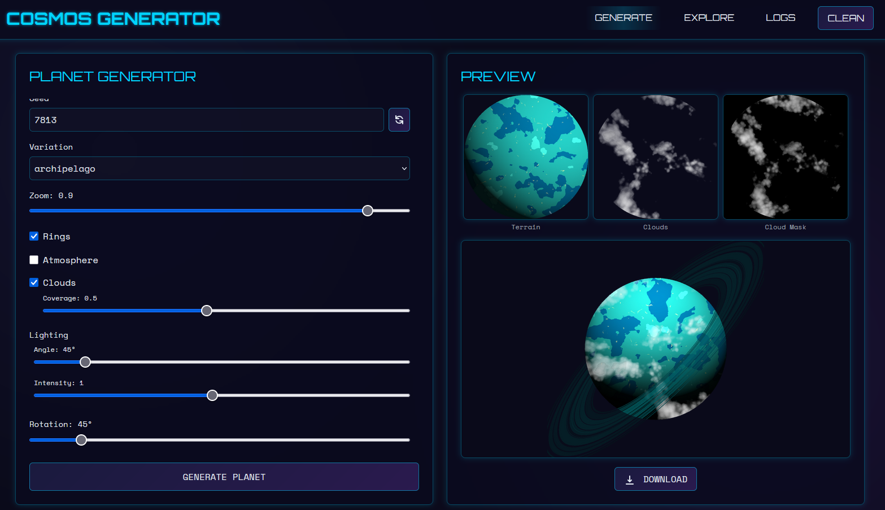

# Cosmos Generator Web Interface

The Cosmos Generator web interface provides a user-friendly way to interact with the Cosmos Generator library, allowing you to generate and explore planets through a browser-based interface.

## Features

- Interactive planet generation form with all available parameters
- Real-time generation with progress tracking
- Gallery of generated planets with filtering options
- Detailed logs viewer
- Responsive design that works on desktop and mobile devices


*Preview of the Cosmos Generator web interface showing the planet generation form and preview panel*

## Getting Started

To launch the web interface, use the `web` subcommand:

```bash
# Launch with default settings (host: 0.0.0.0, port: 4000)
python -m cosmos_generator web

# Launch with custom host and port
python -m cosmos_generator web --host 127.0.0.1 --port 8080

# Launch in debug mode (for development)
python -m cosmos_generator web --debug
```

Once launched, you can access the web interface by opening a web browser and navigating to the URL shown in the console (e.g., http://localhost:4000).

## Interface Sections

### Planet Generator

The main section of the web interface allows you to generate planets with custom parameters:

1. **Planet Type**: Select the type of planet to generate (Desert, Ocean, Furnace, etc.)
2. **Variation**: Choose a specific variation for the selected planet type
3. **Seed**: Enter a seed for reproducible generation or leave blank for a random seed
4. **Features**: Toggle options for rings, atmosphere, and clouds
5. **Lighting**: Adjust light intensity and angle
6. **Advanced Options**: Fine-tune atmosphere parameters, cloud coverage, rotation, and zoom

After setting your parameters, click the "Generate" button to create your planet. The generation process will run in the background, and you'll see real-time progress updates.

### Planet Gallery

The gallery section displays all previously generated planets with thumbnails and details:

- Filter planets by type, features, or seed
- Click on a planet to view it in full size
- See detailed information about each planet's parameters
- Delete individual planets or clean all generated files

### Logs Viewer

The logs section allows you to view detailed logs of the planet generation process:

- View the main planet generation log
- View the web server log
- Filter logs by level (DEBUG, INFO, WARNING, ERROR)
- Search for specific text in the logs

## Web API

The web interface also provides a RESTful API that can be used to interact with the generator programmatically. For detailed information about the API endpoints, parameters, and examples, see the [Web API documentation](../docs/api.md).

## Technical Details

The web interface is built using:

- **Backend**: Flask (Python web framework)
- **Frontend**: HTML, CSS, and JavaScript
- **Communication**: RESTful API with JSON responses
- **Real-time Updates**: Server-sent events (SSE) for progress tracking

## Directory Structure

```
web/
├── static/
│   ├── css/
│   │   └── styles.css
│   ├── js/
│   │   ├── main.js
│   │   ├── generator.js
│   │   ├── gallery.js
│   │   └── logs.js
│   └── img/
│       └── logo.png
├── templates/
│   ├── base.html
│   ├── index.html
│   ├── gallery.html
│   └── logs.html
├── routes/
│   ├── __init__.py
│   ├── api.py
│   ├── generator.py
│   ├── gallery.py
│   └── logs.py
├── __init__.py
├── app.py
└── README.md
```

## Development

If you want to contribute to the web interface development:

1. Clone the repository
2. Install development dependencies: `pip install -r requirements-dev.txt`
3. Launch the web interface in debug mode: `python -m cosmos_generator web --debug`
4. Make your changes to the code
5. Test your changes in the browser
6. Submit a pull request

## Troubleshooting

If you encounter issues with the web interface:

- Check the web server logs: `python -m cosmos_generator web logs --type webserver`
- Make sure you have the required dependencies installed
- Check that the output directory is writable
- Try clearing your browser cache
- If the issue persists, please open an issue on the GitHub repository
